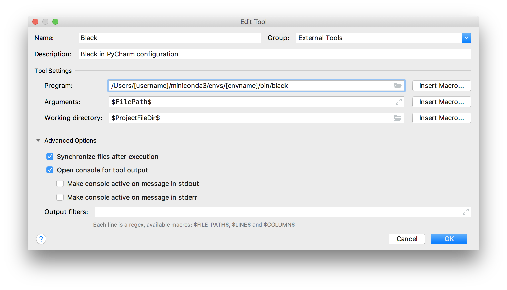
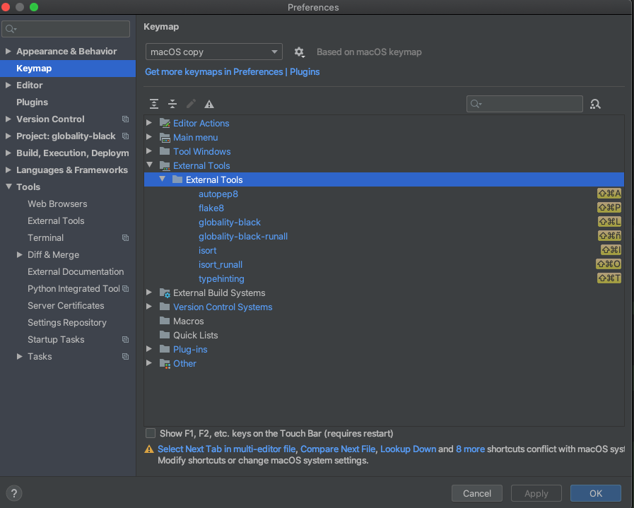
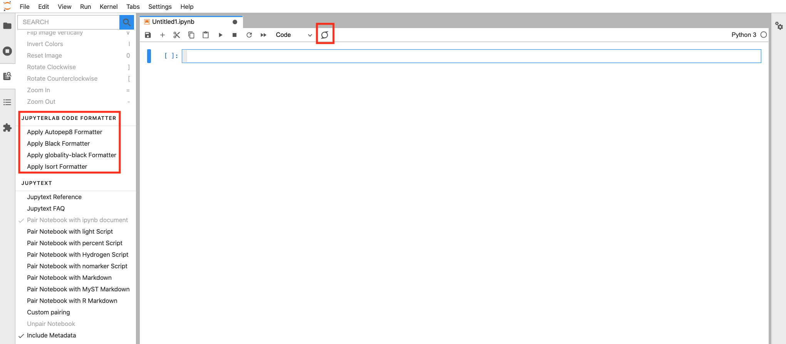

Globality black
===============


A wrapper for [black](https://github.com/psf/black), adding pre- and post-processing 
to better align with Globality conventions.

`globality-black` performs the following steps:

 - pre-processing: to protect from black actions.
 - black
 - postprocessing: to revert / correct black actions.
 
Note: if you are not familiar with black (or need a refresh), please 
read our [Black refresh](#black-refresh).


## Table of contents
1. [Usage](#usage)
   1. [CLI](#cli)
   1. [Pycharm](#pycharm)
   1. [JupyterLab](#jupyterlab)
   1. [VSCode](#vscode)
1. [Features](#features)
   1. [Blank lines](#blank-lines) 
   1. [Dotted chains](#dotted-chains) 
   1. [Comprehensions](#comprehensions) 
   1. [Partially disable Globality Black](#partially-disable-globality-black) 
1. [Pending / Future work](#pending--future-work)
1. [Black refresh](#black-refresh)
   1. [Magic comma](#magic-comma)
1. [FAQ](#faq)


Usage
-----

There are two ways to use `globality-black`, via CLI, or importing the helpers in the library. 
Next, we show some typical use cases:

### CLI

Please see command line arguments running `globality-black --help`. 

### Pycharm

To use `globality-black` in PyCharm, go to PyCharm -> Preferences... -> Tools -> External Tools -> Click + symbol 
to add new external tool.


Recommended configuration to format the current file:
* Program: path to `globality-black`, e.g. `/Users/marty-mcfly/miniconda3/envs/gb/bin/globality-black`
* Arguments: `$FilePath$`
* Working directory: `$ProjectFileDir$`

Recommended configuration to check the whole repo (but not formatting it it):
* Program: path to `globality-black`, e.g. `/Users/marty-mcfly/miniconda3/envs/gb/bin/globality-black`
* Arguments: `. --check`
* Working directory: `$ProjectFileDir$`

Next, configure a keymap, as in [here](https://www.jetbrains.com/help/pycharm/configuring-keyboard-and-mouse-shortcuts.html).



### JupyterLab

We can leverage [this](https://jupyterlab-code-formatter.readthedocs.io/en/latest/how-to-use.html#custom-formatter) extension,
with a custom formatter. Here we explain how to get the following options:




There are two ways to apply `globality-black`, see left-hand-side, or by clicking on the button next to "Code". We will configure
the extension to make it apply the `isort + globality-black` pipeline when clicking such button.

To do so, install the extension, generate the config for jupyter lab and edit it:

```shell script
pip install jupyterlab_code_formatter
jupyter notebook --generate-config
vim ~/.jupyter/jupyter_notebook_config.py
```

with the following code:

```python
from jupyterlab_code_formatter.formatters import SERVER_FORMATTERS
from globality_black.jupyter_formatter import GlobalityBlackFormatter
SERVER_FORMATTERS['globality-black'] = GlobalityBlackFormatter(line_length=100)
```

Then, go to the extension preferences, and add:

```json
{
    "preferences": {
        "default_formatter": {
            "python": [
                "isort",
                "globality-black",
            ],
        }
    },
    "isort": {            
           "combine_as_imports": true,
           "force_grid_wrap": 4,
           "force_to_top": "true",
           "include_trailing_comma": true,
           "known_third_party": ["wandb", "tqdm"],
           "line_length": 100,
           "lines_after_imports": 2,
           "multi_line_output": 3,
    }
}
```

Notes:
 - The extension is applied to all cells in the notebook. It can be configured to be applied just to 
 the current cell, if interested.
 - The extension is applied to each cell in isolation. Hence, if multiple imports appear in different
 cells, they won't be merged together on top of the notebook. 


### VScode

To use `globality-black` in VScode go to Preferences: Keyboard Shortcuts (JSON) from the Palette (command+shift+p)   
It will open a file named `keybindings.json`, then add to this file :
```json
[
    {
        "key": "the shortcut you want (ctrl+b for example)",
        "command": "workbench.action.terminal.sendSequence",
        "args": {
          "text": "globality-black ${file}"
        }
    }
]
```
This will allow you to run `globality-black` per file.
To run `globality-black` to the folder opened in VSCode just replace **file** by **workspaceFolder**.  
You can also add any arguments supported by the CLI (`--check` or `--diff` are recommended to avoid 
formatting the whole repo)


Features
--------

### Blank lines
 
Black would remove those blank lines after `wandb` and `scikit-learn` below:

```
graph.use(
    "wandb",

    "scikit-learn",

    # we love pandas
    "pandas",
)
```

`globality-black` protects those assuming the developer added them for readability. 


### Dotted chains

In a similar fashion to the "blank lines" feature, "dotted chains" allows to keep the block:

```python
return (
    df_field[COLUMNS_PER_FIELD[name]]
    .dropna(subset=["column"])
    .reset_index(drop=True)
    .assign(mapped_type=MAP_DICT[name])
)

LABELS = set(
    df[df.labels.apply(len) > 0]
    .flag.apply(curate)
    .apply(normalize)
    .unique()
)
```

the same. In this feature, **we don't explode anything** but rather protect code assuming it was 
written by this in purpose for readability. 


### Comprehensions 

Explode comprehensions
* all dict comprehensions
* any comprehension with an if
* any comprehension with multiple for loops (see examples below)
* list / set comprehensions where the element:
   - has a ternary operator (see examples below)
   - has another comprehension

For everything else, we rely on `black`. Examples:

#### Before globality-black

```
[3 for _ in range(10)]

[3 for i in range(10) if i < 4]

{"a": 3 for _ in range(4)}

{"a": 3 for _ in range(4) if i < 4}

["odd" if i %% 2 == 0 else "even" for _ in range(10)]

double_comp1 = [3*i*j for i in range(10) for j in range(4)]

double_comp2 = [[i for i in range(7) if i < 5] for j in range(10)]

double_comp3 = {i: [i for i in range(7) if i < 5] for j in range(10) if i < 2}
```

#### After globality-black 

```
[3 for _ in range(10)]

[
    3
    for i in range(10)
    if i < 4
]

{
    "a": 3
    for _ in range(4)
}

{
    "a": 3
    for _ in range(4)
    if i < 4
}

[
    "odd" if i %% 2 == 0 else "even" 
    for _ in range(10)
]

double_comp1 = [
    3 * i * j 
    for i in range(10) 
    for j in range(4)
]

double_comp2 = [
    [i for i in range(7) if i < 5] 
    for j in range(10)
]

double_comp3 = {
    i: [i for i in range(7) if i < 5] 
    for j in range(10) 
    if i < 2
}
```

Note that in the last two comprehensions, the nested comprehensions are not exploded even though
having an if. This is a limitation of `globality-black`, but we believe not very frequent
in everyday cases. If you really want to explode those and make `globality-black` respect it, 
please use the feature explained next.

### Partially disable globality-black

If you see some block where you don't want to apply `globality-black`, wrap it
with `# fmt.off` and `# fmt:on` and it will be ignored. Note that this is the same syntax as
for `black`. For example, for readability you might want to do something as:

```
# fmt: off
files_to_read = [
    (f"{key1}_{key2}", key1, key2, key1 + key2)
    for key1 in range(10)
]
# fmt: on
```

Note that as a default (same as `black`), `globality-black` will write the expression above as a
one-liner.

Pending / Future work
------------

- Explode ternary operators under some criteria
- Nested comprehensions

Please give us feedback if you find any issues


Black refresh
--------

`black` is an opinionated Python formatter that tries to save as much vertical space as possible. In
this regard, it compresses lines to the maximum character length that has been configured. `black`'s
default is 88, whereas in `globality-black` we use a default of 100 characters, as agreed for 
Globality repos globally. If you want to have a custom max character length, add a `pyproject.toml`
file to the root of your repo. This works the same way as in `black`, and `globality-black` will 
take your config from there.

See how `black` works in their [README](https://github.com/psf/black). It is especially useful to 
review [this section](https://github.com/psf/black/blob/master/docs/the_black_code_style.md), where 
important recent features are explained.

### Magic comma
 
`black` added a feature at the end of 2020 that we used to call the "magic comma". It's one of the 
first examples where `black` is giving a bit of freedom to the developer on how the final code will 
look like (apart from `fmt:off` and `fmt:on` to ignore `black` entirely). Read more about it 
[here](https://github.com/psf/black/blob/main/docs/the_black_code_style/current_style.md#the-magic-trailing-comma).

FAQ
---

Here we list a number of questions and solutions raised when presenting this project to other teams:

**I like this project, but this would destroy all our git history and git blames**

Our recommendation is:
 1. Create a big PR for all your repo, and do the effort of reviewing the changes just once.
 1. Add a `.git-blame-ignore-revs` file to your repo, ignoring the bulk commit where 
 `globality-black` is applied. See 
 [here](https://www.moxio.com/blog/43/ignoring-bulk-change-commits-with-git-blame) 
 for more details.

**I like most of the changes, but in some places I really prefer the way I write the code**

No problem, for those specific cases where you like more your style, just wrap the block with 
`fmt:off` and `fmt:on`, see the
[Partially disable Globality Black](#partially-disable-globality-black) section.

**100 characters per line is too short / too long for me**

Just add a `pyproject.toml` to the root of your repo (as the one in this very own 
project) and specify your preferred length, see the [Black refresh](#black-refresh) section.

**I want to know what will be changed before applying the changes**

Please use the `--diff` option from the CLI, see the [CLI](#cli) section.

**I want to explode list of arguments, but `globality-black` is compressing them into one line**

Please use the magic comma feature, see [Magic comma](#magic-comma).